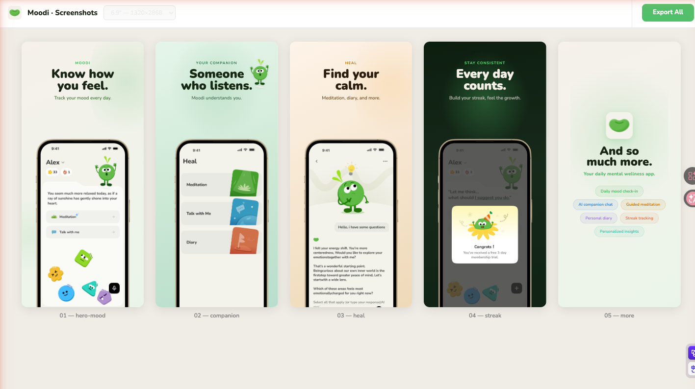

# AppScreen · 应用商店截图生成器

**一个更聪明的 Claude Code Skill，帮你把 APP 原始截图变成应用商店宣传图。**

发 3-8 张截图，Claude 自动分析内容、提炼卖点、生成文案、搭建项目、导出成品。

[English](#english) · 中文

---

## 核心理念

> 截图是广告，不是说明书。

App Store 的截图不是 UI 展示，是转化工具。每张图只卖一个感受或结果。这个 Skill 的设计哲学来自对高转化 App Store 页面的逆向研究——它会逼你做广告，而不是做功能说明。

---

## 5 种核心特点

- **启动方式** — 上传截图，先分析截图，再询问 5 个问题
- **截图理解** — 通过 AI 分析图表达的内容、叙事角色、设计调性
- **设计风格** — 5 种设计风格
- **文案语言** — 中英多语言版本，各有写作规则
- **IP 形象** — 若有 IP 形象/吉祥物等，可插入介绍图片中

---

## 5 种设计风格

| 风格名 | 适合 | 色彩感觉 |
|--------|------|---------|
| `warm-playful` | 角色 IP、健康、情感类 APP | 奶油色 + 自然绿，温暖圆润 |
| `clean-minimal` | 工具、效率、商务类 APP | 白底几何，专业克制 |
| `dark-premium` | 科技、游戏、金融类 APP | 深色底 + 光晕，高级感 |
| `gradient-vivid` | 社交、娱乐、年轻化 APP | 强饱和渐变，活力冲击 |
| `flat-pastel` | 健康、生活、女性向 APP | 马卡龙色系，治愈柔和 |

---

## 工作流程

```
1. 你发来 3-8 张 APP 截图（+ 可选：图标、IP 形象）
   ↓
2. Claude Vision 自动分析每张截图
   · 屏幕类型识别（home / chat / feature / celebration…）
   · 品牌色提取
   · 推荐叙事角色（Hero / 差异化 / 功能 / 信任 / 总结）
   · 推荐幻灯顺序
   ↓
3. 只问你 5 个问题
   APP 名称 / 目标平台 / 文案语言 / 张数 / 风格
   ↓
4. 生成文案（每张 3 套选项，中英双语，你确认后再写代码）
   ↓
5. 搭建 Next.js 项目，构建所有幻灯
   ↓
6. 浏览器预览 → Export All → PNG 文件直接上传 App Store
```

---

## 安装

### 方式一：通过 skills CLI（推荐）

```bash
npx skills add elya/AppScreenshots
```

### 方式二：手动安装

```bash
# 克隆仓库
git clone https://github.com/elya/AppScreenshots.git

# 复制到 Claude Code 全局 skills 目录
cp -r AppScreenshots ~/.claude/skills/appscreen
```

安装后在任意项目中发截图，Claude 就会自动识别并启动这个 Skill。

---

## 使用方法

在 Claude Code 中，直接发送你的 APP 截图，然后说：

```
帮我生成 App Store 宣传图
```

或者英文：

```
Generate App Store screenshots for my app
```

Claude 会立即开始分析截图，无需任何其他配置。

---

## 导出规格

| 设备 | 尺寸 | 备注 |
|------|------|------|
| iPhone 6.9" | 1320 × 2868 | App Store 当前最大尺寸 |
| iPhone 6.5" | 1284 × 2778 | 覆盖 Plus 机型 |
| iPhone 6.3" | 1206 × 2622 | 覆盖 Pro 机型 |
| iPhone 6.1" | 1125 × 2436 | 覆盖标准机型 |

所有尺寸在浏览器工具栏中一键切换，点击 **Export All** 批量下载。

---

## 示例输出

以下是使用本 Skill 为 **Moodbean**（情绪追踪 APP）生成的 5 张宣传图：



| 幻灯 | 标题 | 风格 |
|------|------|------|
| 01 — Hero | Know how you feel. | warm-playful，居中手机 |
| 02 — 差异化 | Someone who listens. | sage green，角色浮动 |
| 03 — 功能 | Find your calm. | 暖琥珀色，手机偏右 |
| 04 — 信任 | Every day counts. | **深色对比**，手机居中 |
| 05 — 总结 | And so much more. | 无手机，功能胶囊 |

---

## 技术栈

生成的项目使用：

- **Next.js 15+** — 开发服务器 + 静态资源
- **TypeScript** — 类型安全
- **Tailwind CSS** — 样式基础
- **html-to-image** — 精确像素级 PNG 导出（优于 html2canvas）
- **Google Fonts** — Nunito / Noto Sans SC / Inter 等

---

## 文件结构

```
AppScreenshots/
├── SKILL.md        # Skill 核心指令（Claude 读取）
├── mockup.png      # iPhone 设备框架（预测量，不可替换）
└── README.md       # 本文件
```

生成的项目结构：

```
your-app-screenshots/
├── public/
│   ├── mockup.png
│   ├── app-icon.png
│   ├── mascot.png          # 可选：IP 形象
│   └── screenshots/
│       ├── 01.png
│       ├── 02.png
│       └── ...
└── src/app/
    ├── layout.tsx
    └── page.tsx            # 单文件生成器，全部逻辑在此
```

---

## 常见问题

**Q：截图用什么格式？**
PNG 或 JPG 均可。RGBA 透明通道不影响导出（会自动处理）。

**Q：支持 Android 吗？**
SKILL.md 中包含 Android 设备框架的完整实现代码，Claude 会在你指定 Google Play 时自动使用。

**Q：导出的图是黑色的怎么办？**
通常是图片预加载未完成。确认 SKILL.md 中的双调用 toPng 技巧已实现，所有图片使用 `img()` helper 而非原始路径。

**Q：中文字体显示为方框？**
将字体从 Nunito 改为 Noto Sans SC（SKILL.md 中有说明）。

**Q：create-next-app 报错说名称不合法？**
Next.js 不允许项目名含大写字母。在父目录执行命令，指定小写名称（如 `myapp-screenshots`）。

---

## License

MIT

---

<a name="english"></a>

# AppScreen · App Store Screenshot Generator

**A smarter Claude Code Skill that turns your raw app screenshots into App Store marketing images.**

Send 3-8 screenshots, and Claude automatically analyzes the content, extracts the selling points, writes copy, scaffolds the project, and exports production-ready images.

---

## Philosophy

> Screenshots are ads, not documentation.

App Store screenshots are conversion tools, not UI showcases. Each image sells one feeling or outcome. This Skill is designed around reverse-engineering high-converting App Store pages — it forces you to make ads, not feature lists.

---

## 5 Key Features

- **Startup flow** — Upload screenshots first; AI analyzes them, then asks only 5 questions
- **Screenshot understanding** — AI reads the content, narrative role, and design tone from each image
- **Design styles** — 5 named styles to choose from
- **Copy language** — Multi-language support (Chinese & English), each with its own writing rules
- **Mascot / IP** — If you have a mascot or character, it can be placed inside the slides

---

## 5 Design Styles

| Style | Best For | Feel |
|-------|----------|------|
| `warm-playful` | Character IP, wellness, emotion apps | Cream + natural green, warm and rounded |
| `clean-minimal` | Utility, productivity, business apps | White geometric, professional restraint |
| `dark-premium` | Tech, gaming, finance apps | Dark background + glow, premium |
| `gradient-vivid` | Social, entertainment, youth apps | Saturated gradients, energetic |
| `flat-pastel` | Health, lifestyle, women-focused apps | Pastel palette, soothing |

---

## How It Works

```
1. You send 3-8 app screenshots (+ optional: icon, mascot)
   ↓
2. Claude Vision analyzes each screenshot automatically
   · Screen type detection (home / chat / feature / celebration…)
   · Brand color extraction
   · Narrative role suggestion (Hero / Differentiator / Feature / Trust / Summary)
   · Recommended slide order
   ↓
3. Claude asks only 5 questions
   App name / Target store / Copy language / Slide count / Style
   ↓
4. Copy is generated (3 options per slide, bilingual, you approve before code starts)
   ↓
5. Next.js project scaffolded, all slides built
   ↓
6. Browser preview → Export All → PNG files ready for App Store upload
```

---

## Installation

### Option 1: via skills CLI (recommended)

```bash
npx skills add elya/AppScreenshots
```

### Option 2: Manual

```bash
git clone https://github.com/elya/AppScreenshots.git
cp -r AppScreenshots ~/.claude/skills/appscreen
```

After installation, just send your screenshots in any Claude Code session — the Skill activates automatically.

---

## Usage

In Claude Code, send your app screenshots and say:

```
Generate App Store screenshots for my app
```

Claude will immediately begin analyzing your screenshots. No other configuration needed.

---

## Export Specs

| Device | Size | Notes |
|--------|------|-------|
| iPhone 6.9" | 1320 × 2868 | Current largest required |
| iPhone 6.5" | 1284 × 2778 | Covers Plus models |
| iPhone 6.3" | 1206 × 2622 | Covers Pro models |
| iPhone 6.1" | 1125 × 2436 | Covers standard models |

Switch between sizes in the toolbar, click **Export All** to batch download.

---

## Tech Stack

Generated projects use:

- **Next.js 15+** — dev server + static assets
- **TypeScript** — type safety
- **Tailwind CSS** — styling
- **html-to-image** — pixel-perfect PNG export (better than html2canvas)
- **Google Fonts** — Nunito / Noto Sans SC / Inter etc.

---

## License

MIT
